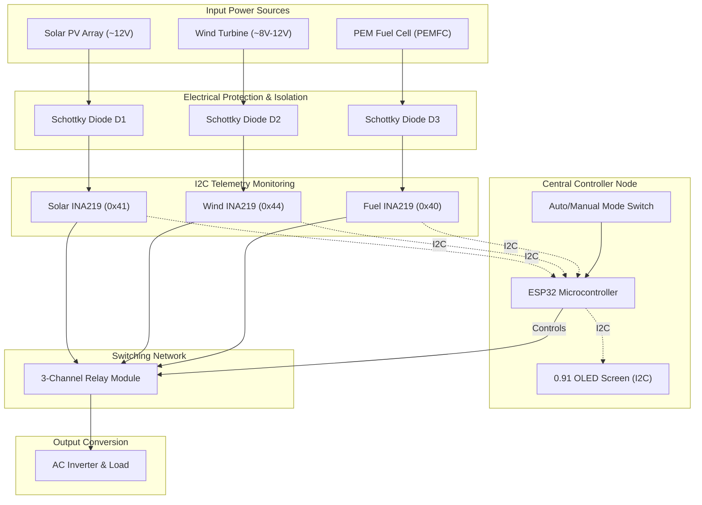

# Multi-Source Intelligent Power Controller (MPC) & Hybrid Renewable Microgrid

An advanced embedded system designed to coordinate and switch between multiple power sources (Solar PV, Wind, PEM Fuel Cell, and Battery Storage) intelligently. Using an ESP32 microcontroller and high-precision INA219 I2C current/power sensors, this system ensures optimal energy utilization based on real-time voltage profiles and priority logic.

---

## 📄 Abstract

Renewable energy sources such as solar photovoltaic and wind energy provide clean power; however, their intermittent nature makes continuous supply challenging. This project integrates a **Proton Exchange Membrane Fuel Cell (PEMFC)** into a hybrid microgrid consisting of solar PV, wind, and battery storage. 

The sources are combined through a common DC bus architecture to enable effective power sharing, source switching, and energy balancing under varying conditions. The system automatically switches priorities, using battery storage for transients and the PEM fuel cell as a long-term backup source.

---

## 🚀 Key Features

* **Intelligent Auto-Switching**: Prioritized source drawing: **Solar PV ➔ Wind Turbine ➔ PEM Fuel Cell / Battery**.
* **Dual Control Modes**: Automatic rule-based logic or manual override controlled via tactile buttons.
* **Real-Time Telemetry**: Monitors and displays Voltage (V), Current (A), and Power (W) for all sources on a SSD1306 OLED screen.
* **Schottky Diode Isolation**: Series blocking diodes prevent reverse leakage currents and cross-source charging.
* **Break-Before-Make Safety**: Solid firmware delays prevent temporary contact shorts during source transitions.
* **Anti-Chatter Protection**: Hysteresis and software filtering prevent rapid relay oscillation at voltage thresholds.

---

## 🏛️ System Architecture

---

## 📚 Documentation Guide

This repository contains highly specialized files detailing different aspects of the hybrid microgrid. Use the links below to explore:

### 1. [Academic Background & Literature Review](docs/academic_background.md)
* The official project Abstract, student authors, acknowledgements, and Department citations.
* Literature survey focusing on complementary renewables, BESS buffers, and PEMFC modeling.

### 2. [System Architecture & Modeling](docs/system_architecture.md)
* Subsystem details including PV array mathematics, wind power coefficient equations, and PEMFC Nernst polarization equation.
* Coordinated power flow description under different environmental conditions.

### 3. [Hardware Design & Circuit blueprints](docs/hardware_design.md)
* Pin assignments for control, status LEDs, and I2C buses.
* Circuit schematic layout, diode placement, and Bill of Materials (BOM).

### 4. [Software Architecture & Control Logic](docs/software_architecture.md)
* Automated rule-based state flow logic and manual toggle control.
* Safety logic (Break-Before-Make) and anti-chatter hysteresis threshold details.
* Comparative study: rule-based switching vs. MPPT-based solar controllers.

### 5. [Code Structure & Firmware Walkthrough](docs/code_structure_and_details.md)
* Line-by-line firmware walkthrough of `src/main.cpp`.
* Library package dependencies, initialization steps, and the global variables structure.

---

## 🔌 Connection Map Quick-Ref

### I2C Bus Address Configuration
* **Solar Sensor (INA219)**: Address `0x41` (A0 to VCC)
* **Wind Sensor (INA219)**: Address `0x44` (A1 to VCC)
* **Fuel Cell Sensor (INA219)**: Address `0x40` (Default)
* **SSD1306 OLED Screen**: Address `0x3C`

### ESP32 Control Pinout
* **GPIO 21 / 22**: I2C Bus (SDA / SCL)
* **GPIO 26 / 25 / 27**: Solar / Wind / Fuel Relays (Active-Low)
* **GPIO 32**: Auto/Manual Mode Switch (Pull-up; GND = Manual)
* **GPIO 33 / 23 / 5**: Solar / Wind / Fuel Manual Select Buttons (Pull-up)
* **GPIO 2 / 4 / 18 / 19**: Heartbeat / Solar / Wind / Fuel Indicator LEDs

---

## 🔧 Installation & Setup

1. **Hardware Assembly**:
   Assemble the components according to the [Hardware Design Guide](docs/hardware_design.md). Ensure the Schottky diodes are mounted in series with the positive terminals of all sources to prevent cross-charging.
2. **Firmware Deployment**:
   * Open `src/main.cpp` in Visual Studio Code with PlatformIO or in the Arduino IDE.
   * Verify the required libraries are installed: `Adafruit_INA219`, `Adafruit_SSD1306`, and `Adafruit_GFX`.
   * Connect the ESP32 via USB and upload the firmware.

---

## 👥 Authors & Academic Context

Developed as a Bachelor of Technology curriculum project in the **Department of Electrical and Electronics Engineering (EEE)** (Batch of 2025-2026):
* **ABIYA S S**
* **AHSANA MEHARIN K N**
* **ANJALY M**
* **ATHULYA SUDARSHAN**

**Under the Guidance of:**
* **Prof. Fini Fathima** (Associate Professor, EEE Department)
* **Dr. V I George** (Principal, MBCCET Peermade)

*Mar Baselios Christian College of Engineering and Technology, Peermade, Idukki, Kerala.*

---

## 📄 License

This project is licensed under the MIT License - see the [LICENSE](LICENSE) file for details.
